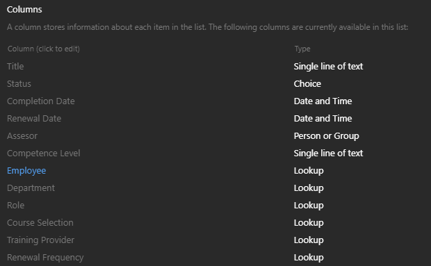
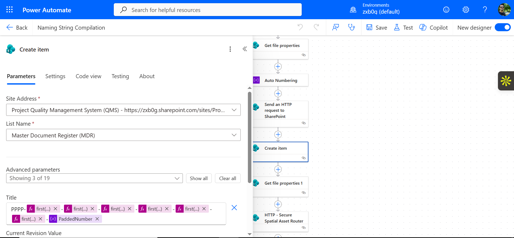

# 🏗️ Offshore Engineering Common Data Environment (CDE) & IMS Compliance Core
### Automated ISO 19650 Master Document Register (MDR), FIDIC Contract Administration, and InfoSec Security Model

---

## 📊 1. Executive Engineering Summary
This repository houses the architecture for an enterprise **Common Data Environment (CDE)** built to manage engineering deliverables, supplier data packages, and contractual lifecycles for offshore asset operations. 

Operating as an **Integrated Management System (IMS)**, the platform coordinates **ISO 9001:2015** (Quality), **ISO 45001:2018** (HSE), and **ISO 14001:2015** (Environmental) governance protocols. The environment enforces strict **ISO 19650** BIM metadata naming, automates **FIDIC Contractual Claims** timelines, and establishes zero-trust **InfoSec (Information Security)** boundaries across external contractors.

---

## 📂 2. CDE Architecture & InfoSec Security Model (SharePoint Online)
The data plane relies on isolated site collections to enforce information barriers and data loss prevention (DLP) across external stakeholders:

### 🔒 InfoSec Access Control Matrix
*   **External Contractors**: Restricted read/write access limited to vendor transmittal dropboxes. They are completely blocked from viewing internal PMC review notes, financial metrics, or contract claims.
*   **Internal PMC Team**: Full structural access to review and cross-reference engineering data sheets against commercial timelines.

### 📐 The Master Document Register (MDR) Ledger
Tracks heavy engineering and commercial metadata parameters across the asset lifecycle:
*   **Asset / Facility Code & Tag Number**: Aligned to **ISO 14224** equipment taxonomy [🔍].
*   **Sour Service Flag**: Yes/No safety classification check for toxic, high-H₂S offshore environments [🔍].
*   **MWS Status**: Marine Warranty Survey clearance tracking gate [🔍].
*   **FIDIC Clause Field**: Maps deliverables to contractual categories (e.g., *Red Book*, *Yellow Book*) [🔍].

📌 

---

## 🔄 3. Workflow Automation Engine (Power Automate)
The backend automation layer contains multiple specialized cloud engines to govern project data integrity and contractual risk:

### 📐 3A. ISO 19650 Standard Code Dictionary
The Power Automate parsing engine maps filenames using this strict structural matrix to automatically route files into their respective spatial and functional folders:

#### 📍 1. Level / Location Spatial Codes
*   `AB`: Anchor Block / Buoy System / Subsea Pipelines
*   `CD`: Cable Deck / Subsea Umbilicals
*   `MD`: Main Deck / Topsides Production
*   `SB`: Substructure / Jacket / Pile Foundations (Jacket_Platform_B)
*   `WL`: Wellhead Platform / Well Bay
*   `XX`: Multiple Locations / Global Area
*   `ZZ`: No Specific Location (Global_Project_Admin)

#### 🏢 2. Originator / Receiver Codes
*   `CONS`: The Engineer / Project Management Consultant (PMC)
*   `CONT`: Main Engineering, Procurement, Construction & Installation (EPCI) Contractor
*   `EEEE`: External Specialized Vendor / Marine Warranty Surveyor (MWS)

#### 🔧 3. Functional Role Codes (ISO 19650 Matrix)
*   `A`: Architect / Naval Architecture
*   `C`: Civil / Structural Engineering
*   `E`: Electrical / Instrumentation / Telecom
*   `H`: HSE / Regulatory / Environmental Compliance
*   `M`: Mechanical / Piping / Process Systems
*   `O`: Operations / Commissioning / Asset Handover Teams
*   `Q`: Quality Assurance / Quality Control / Document Control
*   `S`: Subsea / Geotechnical Engineering
*   `X`: Multi-disciplinary / Cross-functional Projects

#### 📄 4. Document Type Codes
*   `DR`: Drawings / BIM Model Exports (3D to 2D)
*   `EM`: Engineering Manuals / Philosophy Documents
*   `IT`: Inspection and Test Plans (ITP) / Material Inspection Requests (MIR)
*   `LE`: Legal Agreements / Prime Contracts / Guarantees
*   `M3`: 3D BIM Coordination Models / Native Files
*   `MS`: Method Statements / Risk Assessments (RAMS)
*   `NC`: Non-Conformance Reports (NCR) / Audit Deviations
*   `RE`: Progress Reports / Daily Logs / Marine Operations Logs
*   `TR`: Transmittals / Submittals / Official Requests for Information (RFI)
*   `VO`: Variation Orders / Commercial Change Notices / FIDIC Claims

#### 📁 5. Sub-Discipline Description Enforcers
The automated engine matches descriptions to isolate specific file folder lines:
*   **01. Admin**: `GOV` (Governance), `COM` (Communications), `REP` (Reporting), `LMO` (Logistics & Marine Ops)
*   **02. Commercial**: `CON` (Prime Contract), `SUB` (Subcontracts), `VAR` (Variations), `CLM` (Claims), `INS` (Insurances)
*   **03. Project Controls**: `SCH` (Planning), `CST` (Cost), `PAY` (Valuation & Payments)
*   **04. Engineering WIP**: `STR` (Structural), `NAV` (Marine/Naval), `PIP` (Process/Piping), `ELE` (Electrical/E&I), `GEO` (Geotechnical), `BIM` (BIM Hub)
*   **05. Supply Chain**: `VEN` (Vendor Submittals), `EXP` (Expediting)
*   **06. Quality (QMS)**: `QAM` (Quality Manual), `ITP` (Inspection Plans), `NCR` (Non-Conformances), `MAT` (Material Certs)
*   **07. HSSE**: `HSE` (HSSE Plans), `RSK` (Risk Assessments), `REG` (Permits/Regulatory), `INC` (Incident Records)
*   **08. Execution**: `IFC` (Approved Drawings), `SPC` (Specifications), `MSD` (Method Statements)
*   **09. Handover**: `MEC` (Mechanical Completion), `CMR` (Commissioning Records), `OMM` (O&M Manuals), `CRT` (Final Certificates)

*   **Cross-System Synchronization**: On drawing upload to the library vault, it automatically generates a twin metadata record inside the Master Control Register list.

### ⚖️ B. FIDIC Contractual Claims & Variations Router
The engine automatically monitors incoming contractor requests and matches them against active FIDIC clauses [🔍]:
*   **Contract Deadline Gates**: Triggers automated alerts when a variation request or claim approach matches a FIDIC time-bar threshold (e.g., the strict 28-day notice rule).
*   **Approval Escalation Paths**: Dynamically escalates claims to the commercial lead or contract manager depending on the contract type selected.

📌 

---

## 📈 4. Project Controls & IMS Audit Readiness Analytics (Power BI)
The business intelligence layer connects directly to the secure CDE site collections to display live project health metrics.

### Core Governance Visuals Deployed:
*   **IMS Audit Countdown**: Dynamic countdown measuring remaining days until your next third-party regulatory audit.
*   **Contractor MRB Completeness**: Ratios tracking missing Manufacturer Record Books (MRBs) from vendors.
*   **NCR Severity Matrix**: Cross-references outstanding Non-Conformance Reports by severity tier (Critical, Major, Minor), painting impending deadlines or safety overrides in **Crimson Red**.

📌 *Insert your MDR, NCR, and IMS Audit Readiness canvas screenshot right here:*

